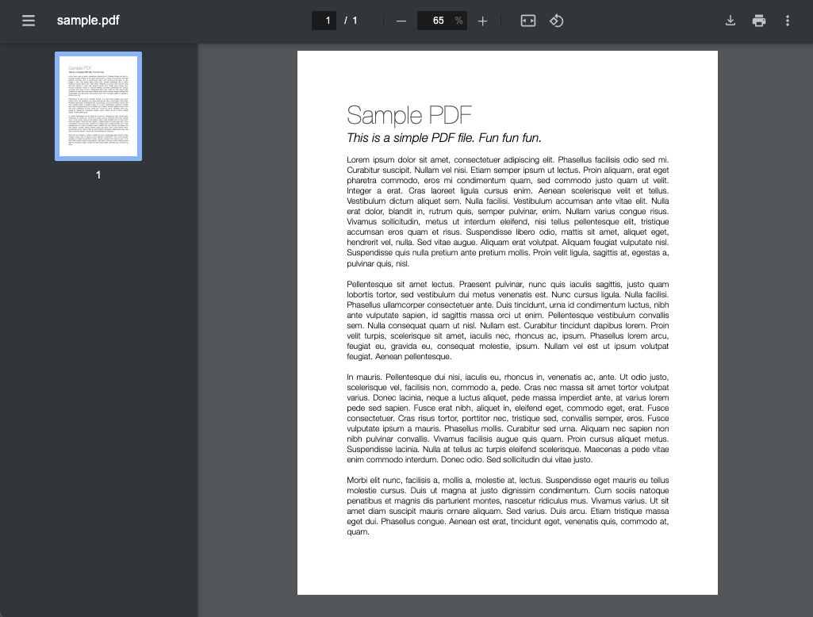

# slickPdfViewer
This is a pure/vanilla Javascript PDF viewer with ***no dependencies*** based on open source software [PDF.JS](https://mozilla.github.io/pdf.js/) (4.7.76)<br>

Since all browsers handle an embedded PDF differently, the goal is to seamlessly emulate Chrome's native PDF viewer accross all browsers/platforms.

### You can see a demo [here](https://jsfiddle.net/bmooreitul/twcn1d0y/)

## In a Nutshell

Most of the time you will only need to use a couple lines of code to render the viewer

:scream: *You dont even need to download or install anything to use the examples below. It can work entirely from the CDN*

```html
<!-- Real code that can be copy and pasted into any website. Super Simple -->
<script type="module">
  import '//cdn.jsdelivr.net/gh/bmooreitul/slickPdfViewer/slickPdfViewer.min.mjs';
  slickPdfView('//pdfobject.com/pdf/sample.pdf');
</script>
```

## Features
 :heavy_check_mark: Works on Mac/PC for all 4 major browsers (Chrome/Firefox/Safari/Edge)<br>
 :heavy_check_mark: CORS download/print with or without embedding in an iframe.<br>
 :heavy_check_mark: Works with cross domain files (Even when printing a remote pdf from within an embedded iframe)<br>
 :heavy_check_mark: Native Print Dialog<br>
 :heavy_check_mark: Native Search<br>
 :heavy_check_mark: Fullscreen/Presentation Mode<br>
 :heavy_check_mark: No dependencies<br>
 :heavy_check_mark: Responsive<br>
 :x: Netscape/Juno/AOL/Explorer. Not catering to 30 year old "requirements" or other equally ridiculous cases<br>

### All Features Confirmed working in these browsers:
:heavy_check_mark: Chrome Version 130.0.6723.58 (Mac)<br>
:heavy_check_mark: Firefox 131.0.2 (Mac)<br>
:heavy_check_mark: Safari 17.6 (Mac)<br>
:heavy_check_mark: Edge Version 129.0.2792.89 (Windows)<br>
:heavy_check_mark: Chrome Version 130.0.6723.70 (Windows)<br>
:heavy_check_mark: Firefox 131.0.3 (Windows)<br>

## What it looks like


The Only Code Used to render the above screenshot is:
```html
<script type="module">
    import '//cdn.jsdelivr.net/gh/bmooreitul/slickPdfViewer/slickPdfViewer.min.mjs';
    slickPdfView({
        fileUrl    : '//pdfobject.com/pdf/sample.pdf',
        thumbnails : true
    });
</script>
```

# Usage

## Basic Example

The below example will render the viewer as html.

```html
<script type="module">
  import '//cdn.jsdelivr.net/gh/bmooreitul/slickPdfViewer/slickPdfViewer.min.mjs';
  slickPdfView('https://example.com/path/to/file.pdf');
</script>
```

## Basic Example Contained

The below example will render the viewer as html contained in a specific element.

```html
<!-- THE ELEMENT THAT WILL CONTAIN THE RENDERED VIEW -->
<div id="appendToMe"></div>

<script type="module">
  import '//cdn.jsdelivr.net/gh/bmooreitul/slickPdfViewer/slickPdfViewer.min.mjs';
  slickPdfView('#appendToMe', 'https://example.com/path/to/file.pdf');
</script>
```

## Basic Example With Extra Options

The below example will render the viewer as html and using additional options.

```html
<script type="module">
  import '//cdn.jsdelivr.net/gh/bmooreitul/slickPdfViewer/slickPdfViewer.min.mjs';
  slickPdfView({
    fileName  : 'custom-file-name.pdf', //CUSTOM NAME WHEN DOWNLOADING/PRINTING AND IN THE TITLE BAR
    fileUrl   : 'https://example.com/path/to/file.pdf', //THE PATH TO THE PDF (CAN BE A FULL URL OR A RELATIVE PATH)
    zoom      : 1.25, //ZOOM IN TO 125% WHEN LOADED
    startPage : 2, //DISPLAY THE 2nd PAGE WHEN LOADED
  });
</script>
```

# Arguments

```javascript
slickPdfView(wrapperSelector, options)
```
<br>

The core class accepts 2 initial arguments. `wrapperSelector` and `options`.<br><br>

If `wrapperSelector` is provided and `options` is not provided, the `options` value is set to the value passed for `wrapperSelector` and `wrapperSelector` is changed to `body`.<br><br>

If `options` is a string, `options` is changed to `options = {fileUrl: options}` and then merged with the default `options`.<br><br><br>

This allows for a flexible combination of use cases.
```javascript

//THIS WILL RENDER THE VIEWER DIRECTLY TO THE BODY ELEMENT
slickPdfView('/path/to/file.pdf');

//THIS WILL RENDER THE VIEWER IN A SPECIFIC ELEMENT
slickPdfView('#appendToMe', '/path/to/file.pdf');

//THIS WILL RENDER THE VIEWER DIRECTLY TO THE BODY ELEMENT AND SET THE FILE NAME
slickPdfView({
  fileName: 'new-name.pdf',
  fileUrl: '/path/to/file.pdf'
});

//THIS WILL RENDER THE VIEWER DIRECTLY TO A SPECIFIC ELEMENT AND SET THE FILE NAME
slickPdfView('#apendToMe > .someElement > #someElementId', {
  fileName: 'new-name.pdf',
  fileUrl: '/path/to/file.pdf'
});

//KITCHEN SINK EXAMPLE: THIS WILL RENDER THE VIEWER DIRECTLY TO A SPECIFIC ELEMENT AND SET SEVERAL OPTIONS
slickPdfView('#appendToMe', {
  fileName       : 'new-name.pdf',      //CUSTOM NAME
  fileUrl        : '/path/to/file.pdf', //URL
  zoom           : 'page-height',       //INITIAL SCALE
  startpage      : 3,                   //SHOW THE 3rd PAGE WHEN LOADED
  padding        : 60,                  //ADD 60px PADDING TO THE INSIDE OF THE VIEWER
  minScale       : 0.1,                 //LIMIT THE MINIMUM ZOOM TO 10%
  maxScale       : 5,                   //LIMIT THE MAX ZOOM TO 500%
  thumbnails     : true,                //DISPLAY THE THUMBNAIL PANEL ON LOAD
});
```

# Options

Here are the default options when instantiating the SlickPdfView class.

```javascript
{
  fileName       : null,
  fileUrl        : null,
  zoom           : 'auto',
  startpage      : 1,
  padding        : 40,
  minScale       : 0.25,
  maxScale       : 4,
  thumbnails     : false,
}
```

| Name | Description |
| --- | --- |
| fileUrl | The location of the pdf. This can be a full url or a relative path. |
| fileName | *Optional* name to display in the titlebar and when downloading.<br><br> *If not provided, this value is automatically set from the file headers returned from the `fileUrl`* |
| zoom | *Optional* value to scale the rendered pdf when loaded.<br><br>**Accepted Values:**<br> - `auto` Automatically Scale the pdf to fit in the viewport<br> - `page-width` Scale the pdf to with the width of the viewport<br> - `page-height` Scale the pdf to fit the height of the viewport<br> - A numeric value like `90` for 90%, `150` for 150% etc. |
| startpage | *Optional* numeric value to specify which page is initially displayed |
| padding | *Optional* numeric value for how much space to add to the inside of the viewer |
| minScale | *Optional* numeric value to limit zooming out. For example `0.25` for 25% `0.5` for 50% etc |
| maxScale | *Optional* numeric value to limit zooming in. For example `1.25` for 125% `4` for 400% etc |
| thumbnails | *Optional* value to display thumbnail sidebar.<br> *This value is automatically set from local storage if the user has toggled this option previously* |

## Untested browsers:
- Opera (Mac)
- Opera (Windows)
- Safari (Windows)
- Brave (Windows)
- Brave (Mac)
