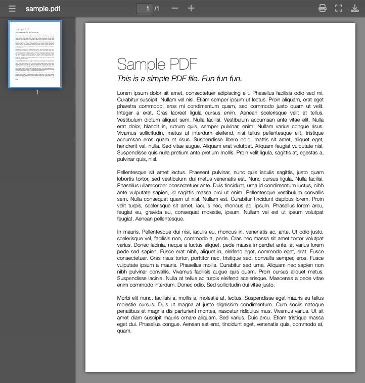

# slickPdfViewer
A pure Javascript PDF reader with no dependencies.

The original purpose of this package was to resolve cross browser display issues with embedding a pdf in an iframe. 
Specifically Safari refuses to show any toolbar options when for pdfs embedded in iframes.

## Features
 :heavy_check_mark: Cross browser support<br>
 :heavy_check_mark: Iframe support<br>
 :heavy_check_mark: Native Print Dialog<br>
 :heavy_check_mark: Fullscreen Mode<br>
 :heavy_check_mark: No dependencies<br>
 :heavy_check_mark: Responsive<br>

### Demo
You can see a demo here https://laraveldocs.itulbuild.com/examples/slickPdfViewer/1 <br>
> [!NOTE]
> Please note codepen blocks the print and download functionality in the preview because the pdf is not hosted on the same domain.
> This package doesnt currently support cross domain printing and/or download functionality.
> To ensure print and download functionality work, you must host the pdf on the same domain.


## What it looks like


# Usage

## Basic Example

The below example will render the viewer as html.

```html
<!-- THE ELEMENT THAT WILL CONTAIN THE RENDERED VIEW -->
<div id="appendToMe"></div>

<!-- INCLUDE THE PACKAGE FROM CDN -->
<script type="text/javascript" src="//cdn.jsdelivr.net/gh/bmooreitul/slickPdfViewer/slickPdfViewer.min.js"></script>

<script>
  new SlickPdfView('#appendToMe', {
    fileUrl : 'https://example.com/path/to/file.pdf' //THE PATH TO THE PDF (CAN BE A FULL URL OR A RELATIVE PATH)
  });
</script>
```

## Iframed Example

The below example will render the viewer inside of an iframe element.

```html
<!-- THE ELEMENT THAT WILL CONTAIN THE RENDERED VIEW -->
<div id="appendToMe"></div>

<!-- INCLUDE THE PACKAGE FROM CDN -->
<script type="text/javascript" src="//cdn.jsdelivr.net/gh/bmooreitul/slickPdfViewer/slickPdfViewer.min.js"></script>

<script>
  SlickPdfView.iframed('#appendToMe', {
    fileUrl : 'https://example.com/path/to/file.pdf' //THE PATH TO THE PDF (CAN BE A FULL URL OR A RELATIVE PATH)
  });
</script>
```

# Options

Here are the default options when instantiating the SlickPdfView class.

```javascript
{
  fileName   : null,
  fileUrl    : null,
  zoom       : 'auto',
  startpage  : 1,
  paddingY   : 40,
  minScale   : 0.25,
  maxScale   : 4,
  uniqueId   : null
}
```

| Name | Description |
| --- | --- |
| fileName | *Optional* name to display in the titlebar and when downloading.<br><br> *If not provided, this value is automatically set from the file headers returned from the `fileUrl`* |
| fileUrl | The location of the pdf. This can be a full url or a relative path. |
| zoom | *Optional* value to scale the rendered pdf when loaded.<br><br>**Accepted Values:**<br> - `auto` Automatically Scale the pdf to fit in the viewport<br> - `page-width` Scale the pdf to with the width of the viewport<br> - `page-height` Scale the pdf to fit the height of the viewport<br> - A numeric value like `90` for 90%, `150` for 150% etc. |
| startpage | *Optional* numeric value to specify which page is initially displayed |
| paddingY | *Optional* numeric value for how much space to add to the inside of the viewer |
| minScale | *Optional* numeric value to limit zooming out. For example `0.25` for 25% `0.5` for 50% etc |
| maxScale | *Optional* numeric value to limit zooming in. For example `1.25` for 125% `4` for 400% etc |
| uniqueId | *Optional* value to use as a unique id for the rendered viewer to support multiple viewers on the same page.<br><br> *This is set automatically if not provided* |


